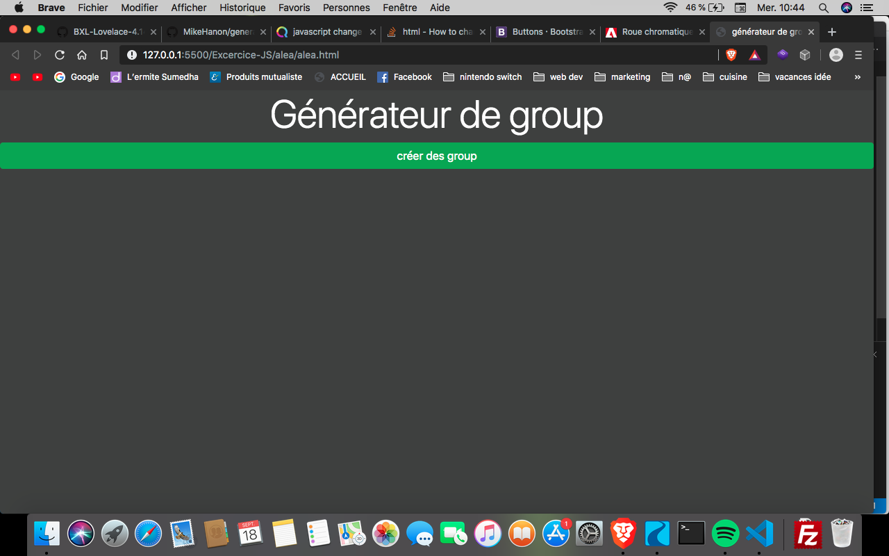

# Générateur de groupe aléatoire

Réalisation d'un générateur de groupe pour la formation Becode. On commence par rentrer le nombre total de participant, ensuite on rentre leur nom et on termine par le nombre de groupe souhaité. Le script vas d'abord mélangé les noms avant de les sortir en groupe.

## Construit avec

Javascript

## Autheurs

* **Hanon Mikhaïl** MikeHanon (https://github.com/MikeHanon)

